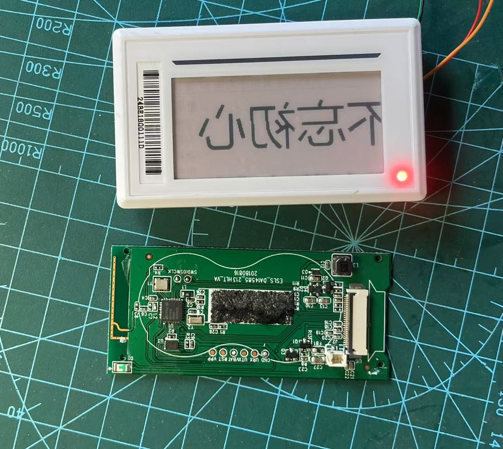

# intro
I baught this device from taobao for 1.3 RMB.

# spec
- da14585 controoller
- 2.13 inch red/black e-ink/e-paper

# pins
| epd pin   | mcu pin   |
|--------|------|
| busy   | P11    |
| rst   | P10      |
| D/C   | p07    |
| cs   | p21    |
| clk   | p01      |
| sdi   | p20    |
| power   | p21    |

# usage:
put the project at sdk's example, 6.0.18.1182.1\projects\target_apps\peripheral_examples\

# note
- the OTP is burnt, but there is a secondary bootloader, user project_multipart_binary_v2.py to generate the image. Production header is at 0x38000:  
MEM_LOC_FOR_PRODUCT_HEADER 	= "0x38000" 

# todo:
- the data direction seems wrong
- add ble feature to send picture? There are open source project for nrf51802 and tlsr mcu.

